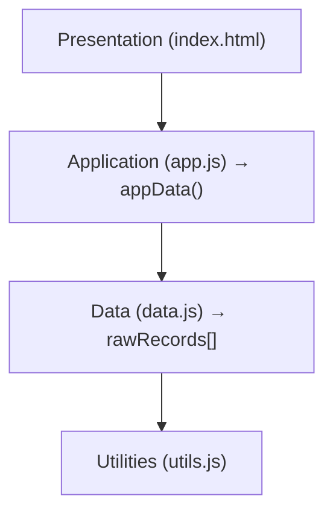

# CLAUDE.md

This file provides guidance to Claude Code (claude.ai/code) when working with code in this repository.

## §1 Project Identity

```yaml
name: 業者見積データベース (Vendor Quote Database)
type: Static SPA (no build step)
purpose: Search and analyze construction vendor quotes
```

## §2 Tech Stack

```yaml
framework: Alpine.js 3.15.3 (CDN)
css: Bootstrap 5.3.3 (CDN)
charts: Chart.js 4.4.1 (CDN)
language: JavaScript (ES6+)
```

## §3 Architecture

### §3.1 File Structure

```yaml
kentaku/:
  index.html: SPA entry point
  css/:
    style.css: Bootstrap overrides, layout customization
  js/:
    utils.js: Pure utility functions (fmt, parseDate, getWeekNumber)
    data.js: Raw data source (rawRecords[])
    app.js: Alpine.js component (appData())
```

### §3.2 Layer Dependencies



### §3.3 Script Load Order

ALWAYS load scripts in this exact order:

1. Bootstrap JS (CDN)
2. Chart.js (CDN)
3. utils.js
4. data.js
5. app.js
6. Alpine.js (CDN, with `defer`)

## §4 Data Structure

```yaml
rawRecords[]:
  region: Branch name (厚木|横浜|高崎|春日部|つくば)
  projectName: Construction project name
  majorCode: Major work item code (e.g., "026")
  item: Item name
  spec: Specification
  unit: Unit of measure
  qty: Quantity
  price: Unit price (JPY)
  vendor: Vendor name
  orderDate: Order date (YYYYMMDD format)
  floors: Number of floors
  unitRow: Unit row count
  resUnits: Residential unit count
  constArea: Construction area (㎡)
  totalArea: Total floor area (㎡)
```

## §5 Alpine.js Rules

```yaml
ALWAYS:
  - Pair x-cloak with CSS rule: "[x-cloak] { display: none !important; }"
  - Use <template> tag with :key for x-for loops
  - Use @ shorthand for events (@click, NOT x-on:click)

NEVER:
  - Apply x-for directly on non-template elements
  - Omit :key in x-for loops
```

## §6 Key Functions

| Location   | Function               | Purpose                          |
| ---------- | ---------------------- | -------------------------------- |
| app.js     | appData()              | Main Alpine component            |
| app.js     | applyFilters()         | Filter records by criteria       |
| app.js     | showChart(idx)         | Display Chart.js price trend     |
| utils.js   | fmt(n)                 | Format number with locale        |
| utils.js   | getWeekNumber(dateStr) | Convert YYYYMMDD to ISO week     |

## §7 Modification Procedures

### §7.1 Add Quote Records

1. Edit `js/data.js`
2. Append object to rawRecords[] with all required fields (§4)
3. ALWAYS use YYYYMMDD format for orderDate

### §7.2 CSS Customization

```yaml
priority:
  1: Bootstrap utility classes
  2: css/style.css overrides

css_variables:
  --sidebar-width: 300px
  --header-height: 56px

breakpoints: Bootstrap standard (lg: 992px, xl: 1200px)
```

## §8 Bootstrap 5 Best Practices

### §8.1 Utility-First Approach

ALWAYS use Bootstrap utilities before custom CSS:

```yaml
ALWAYS:
  - Use utility classes for spacing, flexbox, colors, typography
  - Combine utilities on single elements (e.g., "d-flex align-items-center gap-3")
  - Use responsive variants when needed (e.g., "d-lg-flex", "mb-md-4")

NEVER:
  - Write custom CSS for spacing (use m-*, p-*, gap-*)
  - Write custom CSS for flexbox alignment (use d-flex, align-items-*, justify-content-*)
  - Use inline styles for Bootstrap-supported properties
```

### §8.2 Spacing Utilities

```yaml
pattern: "{property}{sides}-{size}"

property:
  m: margin
  p: padding

sides:
  t: top
  b: bottom
  s: start (left in LTR)
  e: end (right in LTR)
  x: horizontal (left + right)
  y: vertical (top + bottom)
  (blank): all sides

size: 0 | 1 | 2 | 3 | 4 | 5 | auto

examples:
  - mb-4: margin-bottom with size 4
  - px-3: padding horizontal with size 3
  - py-2: padding vertical with size 2
  - gap-3: gap between flex/grid children
```

### §8.3 Flexbox Utilities

```html
<!-- Alignment -->
<div class="d-flex align-items-center justify-content-between">...</div>

<!-- Responsive flex -->
<div class="d-flex flex-column flex-lg-row">...</div>

<!-- Gap between children -->
<div class="d-flex gap-2">...</div>
```

### §8.4 Color Utilities

```yaml
text_colors:
  - text-primary, text-secondary, text-success, text-danger
  - text-warning, text-info, text-light, text-dark
  - text-muted, text-body, text-white

background_colors:
  - bg-primary, bg-secondary, bg-success, bg-danger
  - bg-warning, bg-info, bg-light, bg-dark
  - bg-white, bg-transparent

combined: text-bg-primary (auto-contrasting foreground)
```

### §8.5 Typography Utilities

```yaml
font_weight:
  - fw-bold, fw-semibold, fw-medium, fw-normal, fw-light

font_style:
  - fst-italic, fst-normal

font_size:
  - fs-1 (largest) to fs-6 (smallest)

text_alignment:
  - text-start, text-center, text-end
```

### §8.6 Border & Rounded Utilities

```yaml
borders:
  - border, border-top, border-bottom, border-start, border-end
  - border-0, border-top-0 (remove borders)
  - border-primary, border-secondary (colors)

rounded:
  - rounded, rounded-0, rounded-1, rounded-2, rounded-3
  - rounded-circle, rounded-pill
  - rounded-top, rounded-bottom, rounded-start, rounded-end
```
