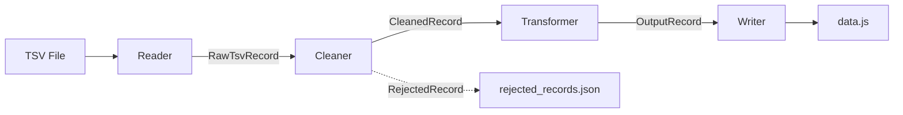

# CLAUDE.md

Guidance for Claude Code when working with this repository.

## §1 Project Identity

```yaml
project: TSV Converter
type: Node.js CLI Tool (TypeScript)
purpose: Convert TSV export files to data.js for the Vendor Quote Database SPA
output: ../../js/data.js (parent project's data source)

stack:
  runtime: Node.js (ESM)
  language: TypeScript (ES2022, strict mode)
  parsing: csv-parse
  validation: Zod
  testing: Vitest + factory.ts
```

---

## §2 Commands

```yaml
convert: npm run convert -- <input.tsv> [output_dir]

development:
  test: npm run test
  lint: npm run lint
  fix: npm run fix
  typecheck: npm run typecheck

quality_gates:
  - ALWAYS run `npm run lint` after code changes
  - ALWAYS run `npm run test` before committing
  - ALWAYS fix ALL errors before marking task complete
  - NEVER ignore lint/type errors
```

---

## §3 Architecture

### §3.1 Pipeline Pattern



### §3.2 Directory Convention

```yaml
src/:
  index.ts: CLI entry point
  types/: Type definitions (Raw, Cleaned, Output records)
  pipeline/: Processing stages (reader, cleaner, transformer, writer)
  validators/: Exclusion rules, Zod schemas
  reports/: Statistics display

test/:
  factories/: Test data factories (→ §5)
  [module]/: Tests mirror src/ structure
```

### §3.3 Type Flow

```yaml
flow: RawTsvRecord → CleanedRecord → OutputRecord
principle: Each stage has dedicated input/output types
location: src/types/*.ts
```

---

## §4 Exclusion Rules

```yaml
principle: Records excluded at cleaner stage, tracked in rejected_records.json

active_rules:
  - ZERO_QUANTITY: 実行数量 = 0 or empty
  - NO_VENDOR: 業者名 empty or 業者コード = "NULL"
  - INVALID_DATE: 発注日 not YYYYMMDD format
  - INVALID_DATA: Transformation error (catch-all)

implementation: src/validators/rules.ts → checkExclusion()

ALWAYS:
  - Add new rules in priority order
  - Update ExclusionReason type when adding rules
```

---

## §5 Testing

```yaml
framework: Vitest + factory.ts
location: test/factories/

factory_convention:
  base: [Type]Factory (e.g., RawTsvRecordFactory)
  variants: [Condition]RecordFactory (e.g., ZeroQuantityRecordFactory)
  utilities: base.factory.ts (createFactoryWrapper, resetAllFactories)

ALWAYS:
  - Use factories for ALL test data
  - Call resetAllFactories() in beforeEach
  - Create variant factories for exclusion cases
  - Reference test/factories/CLAUDE.md for detailed conventions

NEVER:
  - Create object literals manually in tests
  - Duplicate factory definitions
```

---

## §6 Validation

```yaml
framework: Zod v4
location: src/validators/record.ts

principle: Schema mirrors CleanedRecord interface
pattern: z.object({ field: z.type().constraint() })

ALWAYS:
  - Keep schema in sync with CleanedRecord type
  - Use appropriate constraints (min, regex, positive, nonnegative)
```

---

## §7 Coding Conventions

```yaml
ALWAYS:
  - Use normalizeWhitespace() for text fields
  - Use parseNumber() / parseInteger() for numeric fields
  - Export via index.ts barrel files
  - Use unknown instead of any

NEVER:
  - Hardcode field mappings in multiple places
  - Skip factory.ts for test data
  - Ignore TypeScript strict mode errors
```

---

## §8 Adding New Fields

```yaml
principle: Follow the pipeline - update each stage in order

stages:
  1_types: Add to RawTsvRecord → CleanedRecord → OutputRecord
  2_pipeline: Update transformRecord() and transformToOutput()
  3_validation: Add to CleanedRecordSchema if constraints needed
  4_tests: Update factory defaults in record.factory.ts

ALWAYS:
  - Run lint and test after each stage
  - Maintain type consistency across all stages
```

---

## §9 Report Maintenance

```yaml
principle: Keep reports in sync with conversion logic

outputs:
  - Console: printSummary() in src/reports/summary.ts
  - Markdown: summaryToMarkdown() → conversion_report.md

ALWAYS:
  - Update BOTH console and markdown reports when modifying conversion logic
  - Add new statistics to ProcessingSummary interface first
```
